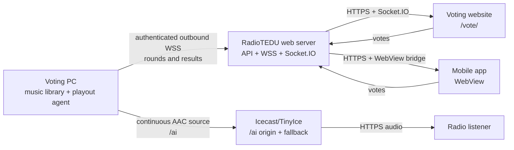

# VoterTAI

VoterTAI is RadioTEDU's listener-controlled radio system. Listeners vote for
the next song on the website or inside the mobile app, the web server keeps the
authoritative voting round, and a supervised Windows playout PC streams the
winning music continuously to the `/ai` radio mount.

This repository contains the complete voting stack:

- the public React voting website;
- the web-server voting API and real-time transport;
- the Windows voting and radio agent;
- the process supervision, startup, recovery, and stream diagnostics needed
  to keep the station running.

## What the project does

1. The Voting PC scans a local music directory and starts a continuous radio
   stream.
2. While the current song plays, the agent selects eligible candidates and
   publishes a voting round to the backend over an outbound authenticated WebSocket.
3. Browsers and the mobile WebView receive the active round and live vote
   totals from the web server.
4. The backend locks and resolves the round authoritatively.
5. The winning song is queued on the Voting PC and becomes the next track.
6. If no winner is available, the agent continues with filler music. It never
   intentionally stops the audio encoder between tracks.

## Architecture



The mobile app and public website never connect directly to the Voting PC.
The PC requires no public inbound port: it initiates both the backend WebSocket
and the Icecast source connection.

## Repository structure

```text
votertai/
├── backend/                         RadioTEDU server and voting integration
│   ├── src/routes/nextSongVoting.ts Public voting HTTP routes
│   ├── src/services/
│   │   ├── nextSongVotingService.ts Authoritative voting-round logic
│   │   └── radioAgentTunnel.ts      Authenticated Voting PC WebSocket tunnel
│   ├── src/votingWebRoutes.ts       /vote/ static-site hosting
│   ├── src/db/migrations/           Voting database migration
│   ├── .env.example                 Server configuration template
│   └── Windows-Deployment.md        Windows server deployment notes
│
├── voting-web/                      Public browser and mobile WebView UI
│   ├── src/App.tsx                  Voting screen
│   ├── src/voting.ts                API, socket, and stream configuration
│   ├── src/styles.css               RadioTEDU voting design
│   ├── public/                      Static assets
│   └── README.md                    WebView bridge and frontend contract
│
├── tools/local-voting-agent/        Windows playout/source application
│   ├── src/agent/
│   │   ├── backendClient.ts         Outbound authenticated WSS client
│   │   ├── folderCatalog.ts         Music-folder scanning and metadata
│   │   ├── roundEngine.ts           Candidate, vote, lock, and winner logic
│   │   ├── localHttpStreamer.ts     Continuous local MP3 stream
│   │   ├── icecastRelay.ts          Continuous PCM-to-AAC Icecast source
│   │   └── processLock.ts           Duplicate-process protection
│   ├── src/server/                  Local API, dashboard, and automation
│   ├── src/web/                     Local diagnostic dashboard
│   ├── scripts/
│   │   ├── voting-supervisor.mjs    Health watchdog and process recovery
│   │   ├── install-voting-startup.ps1
│   │   └── start-production-voting-round.ps1
│   ├── WEB_SERVER_AI_STREAM_HANDOFF.md
│   ├── .env.example                 Voting PC configuration template
│   └── README.md                    Detailed agent operations
│
├── .gitignore
└── README.md
```

Generated `dist/`, `dist-server/`, runtime logs, process locks, credentials,
and local `.env` files are not committed.

## Production endpoints

| Purpose | URL |
|---|---|
| Voting website | `https://radiotedu.com/vote/` |
| Mobile WebView | `https://radiotedu.com/vote/?embed=1` |
| Voting API base | `https://radiotedu.com/jukebox/api/v1` |
| Socket.IO transport | `https://radiotedu.com/jukebox/socket.io` |
| Radio stream | `https://stream.radiotedu.com/ai` |
| Agent WebSocket | `wss://radiotedu.com/jukebox/api/v1/next-song-voting/agent/connect` |

## Requirements

### Web server

- Node.js 20 or newer
- PostgreSQL
- Redis
- Icecast-compatible origin such as TinyIce
- Nginx or an equivalent TLS reverse proxy
- A server-local fallback audio source for zero-dead-air operation

### Voting PC

- Windows 10 or 11
- Node.js 20.6 or newer
- FFmpeg and ffprobe
- A readable local music directory
- A dedicated backend agent identity and secret
- A dedicated Icecast source account for `/ai`

## Quick start

### 1. Build and test the website

```powershell
cd voting-web
npm ci
npm test
npm run build
```

Use `npm run dev` for local frontend development. The development-only demo is
available at `http://127.0.0.1:4321/?demo=1` and is not enabled in production.

### 2. Build and test the backend

```powershell
cd backend
npm ci
Copy-Item .env.example .env
npm run db:migrate
npm run db:migrate:voting-agent
npm test
npm run build
```

The backend must be deployed with its protected production environment. Do not
use example database passwords, JWT secrets, agent secrets, or source
credentials in production.

### 3. Configure the Voting PC

```powershell
cd tools\local-voting-agent
npm ci
Copy-Item .env.example .env
npm test
npm run build
```

At minimum, configure these values in the local `.env`:

```dotenv
MUSIC_LIBRARY_DIR=C:\Path\To\Music
VOTING_AGENT_PLAYBACK_MODE=live

LOCAL_HTTP_STREAM_ENABLED=true
LOCAL_HTTP_STREAM_PORT=4320
LOCAL_HTTP_STREAM_PATH=/ai

ICECAST_STREAM_ENABLED=true
ICECAST_SOURCE_URL=http://stream.radiotedu.com/ai
ICECAST_SOURCE_USERNAME=<dedicated-source-user>
ICECAST_SOURCE_PASSWORD=<dedicated-source-password>

BACKEND_SYNC_ENABLED=true
RADIO_AGENT_TRANSPORT=websocket
RADIO_AGENT_CONNECT_URL=wss://radiotedu.com/jukebox/api/v1/next-song-voting/agent/connect
RADIO_AGENT_ID=school-radio-pc
RADIO_AGENT_REQUEST_SECRET=<dedicated-agent-secret>
```

Install the supported per-user automatic startup launcher:

```powershell
powershell -ExecutionPolicy Bypass -File .\scripts\install-voting-startup.ps1
```

The launcher starts the Node supervisor after Windows sign-in. The supervisor
checks the local API and actual local audio bytes, tolerates transient failures,
and replaces the managed agent only after repeated health failures.

## Voting and playback lifecycle

```text
Track starts
  -> candidates are selected
  -> round is published to the backend
  -> listeners vote
  -> backend locks and resolves the round
  -> winner is queued
  -> winner plays when the current track ends
  -> next round opens
```

Recent tracks and the currently playing song are excluded from candidate
selection when possible. No-vote rounds and ties have deterministic fallback
resolution paths, so automation does not wait forever for a ballot.

## Resilience model

The Windows agent is designed to recover without manual intervention:

- an exclusive process lock prevents two agents from racing for `/ai`;
- a separate supervisor lock prevents duplicate watchdogs;
- the music encoder remains alive across normal track transitions;
- short PCM silence frames cover decoder startup or recovery gaps;
- stalled decoders are terminated and replaced;
- FFmpeg pipe errors do not crash the Node process;
- backend WSS and Icecast connections retry indefinitely with bounded backoff;
- music files are rescanned periodically;
- media probes have hard timeouts, so a damaged file cannot block boot;
- the supervisor validates real local audio, not merely an open TCP port;
- logs report state changes rather than repeating every failed retry.

Zero dead air on the public URL also requires a server-local fallback mount.
The Voting PC cannot provide audio while it is powered off or disconnected, so
the Icecast/TinyIce origin must keep fallback audio active and automatically
return listeners to the primary `/ai` source after reconnection. See
[`WEB_SERVER_AI_STREAM_HANDOFF.md`](tools/local-voting-agent/WEB_SERVER_AI_STREAM_HANDOFF.md).

## Mobile WebView integration

The mobile application embeds `https://radiotedu.com/vote/?embed=1`. It must not
place access tokens in the URL. After the page sends
`radiotedu.voting.ready`, the app injects the existing mobile session through
the in-memory bridge:

```js
window.__RADIOTEDU_SET_AUTH__({
  accessToken: '<mobile access token>',
  user: {display_name: 'Listener', is_guest: false}
});
true;
```

The page reports successful votes with `radiotedu.voting.vote-recorded`. See
[`voting-web/README.md`](voting-web/README.md) for the complete navigation and
message contract.

## Health and verification

Local agent health:

```powershell
Invoke-RestMethod http://127.0.0.1:4317/api/health
Invoke-RestMethod http://127.0.0.1:4317/api/state
```

Expected health includes:

- `playbackState: "playing"`
- `backendConnection: "connected"`
- a non-error Icecast source state
- the detected catalog track count

Verify public audio by decoding it, not only by checking HTTP headers:

```powershell
ffmpeg -hide_banner -loglevel error `
  -t 30 `
  -i https://stream.radiotedu.com/ai `
  -f null NUL
```

Run all package checks before deployment:

```powershell
cd voting-web
npm ci
npm test
npm run build

cd ..\backend
npm ci
npm test
npm run build

cd ..\tools\local-voting-agent
npm ci
npm test
npm run build
```

## Security boundaries

- Never commit `.env` files, passwords, tokens, local paths, runtime logs, or
  source URLs containing credentials.
- Use a dedicated agent ID and secret for VoterTAI; do not reuse the Juke Local
  or BroadcastAI identity.
- The web server validates the agent handshake and remains authoritative for
  vote acceptance and resolution.
- The local control API binds to loopback only.
- Album art and candidate payloads are validated and size-limited before they
  reach the public backend.
- The mobile WebView accepts only the production voting origin and keeps auth
  tokens in memory.
- `/ai` belongs exclusively to the VoterTAI voting channel. Other RadioTEDU
  mounts are outside this project's ownership.

## Further documentation

- [Voting website and WebView contract](voting-web/README.md)
- [Windows voting agent operations](tools/local-voting-agent/README.md)
- [`/ai` web-server handoff and acceptance tests](tools/local-voting-agent/WEB_SERVER_AI_STREAM_HANDOFF.md)
- [Backend Windows deployment](backend/Windows-Deployment.md)

## License and ownership

VoterTAI is a RadioTEDU project. Add the organization's chosen license before
redistributing the code outside its intended deployment.
